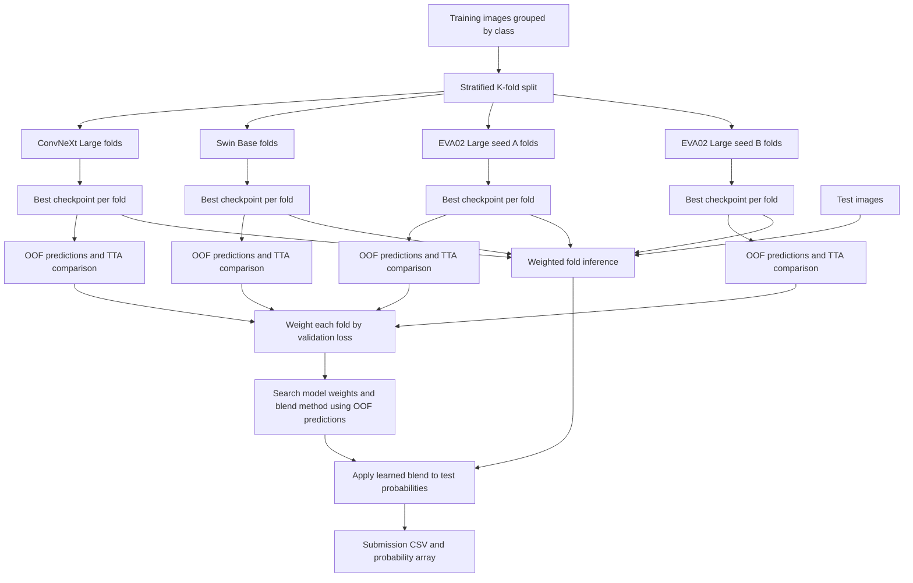

# Image Classification Ensemble

This project trains several pretrained image classifiers and combines their predictions into one submission. The code is organized so that a reader can understand the workflow without unpacking a single large notebook cell.

The original experiments are preserved under `artifacts/previous_runs/`. The improved pipeline lives under `code/`, and the notebook in `notebooks/` contains the complete pipeline as directly executable Google Colab cells.

## Project Layout

```text
FinalProject/
|-- artifacts/
|   |-- previous_runs/              # Original saved checkpoints and predictions
|   `-- imported_volume_metadata/   # Unrelated macOS metadata from the imported drive
|-- code/
|   |-- image_ensemble/
|   |   |-- config.py               # Models and hyperparameters
|   |   |-- data.py                 # Dataset discovery and image preprocessing
|   |   |-- ensemble.py             # OOF weight optimization and blending
|   |   |-- models.py               # timm model creation and optimizer groups
|   |   |-- runner.py               # Full experiment orchestration
|   |   `-- training.py             # Fold training, EMA, TTA, and inference
|   |-- run_training.py             # Command-line entry point
|   `-- build_standalone_notebook.py # Regenerates the self-contained notebook
|-- data/
|   `-- README.md                    # Expected local dataset layout
|-- docs/
|   `-- workflow.mmd                 # Standalone Mermaid diagram
|-- notebooks/
|   |-- H100_Complete_Ensemble_Code.ipynb
|   `-- archive/
|       `-- H100_Complete_Ensemble_Code_original.ipynb
|-- tests/
|   |-- test_config.py
|   `-- test_ensemble.py
|-- requirements.txt
`-- README.md
```

## Models

The pipeline uses transfer learning: each network starts with weights learned from a large image dataset and replaces its final classifier with a 100-class output layer.

### ConvNeXt Large

ConvNeXt is a convolutional neural network with a modernized architecture. Convolutions are especially good at recognizing local visual patterns such as edges, textures, and shapes. The project uses a large ConvNeXt model pretrained on ImageNet-22k and fine-tuned on ImageNet-1k.

### Swin Base

Swin is a hierarchical vision transformer. It divides an image into patches and applies attention inside shifted local windows. This gives the ensemble a model family with different assumptions than ConvNeXt, which can help when the models make different mistakes.

### EVA02 Large

EVA02 is the strongest individual family observed in the previous experiments. Its best saved fold reached `88.9%` validation accuracy, compared with `83.3%` for ConvNeXt and roughly `81%` for Swin.

The improved configuration trains two EVA02 variants with different random seeds and slightly different optimization settings. This spends more compute on the strongest family while retaining independently trained predictions for diversity.

## Training data

https://drive.google.com/drive/u/0/folders/1UNRq0jdWflMxFF0EVncCcCD-Y7RxajYv

## Validation Strategy

The dataset is split with four-fold stratified cross-validation. Stratification preserves the class distribution in every fold.

For each model variant:

1. Three folds train the model and the remaining fold validates it.
2. The best checkpoint is selected by validation accuracy, with validation log loss used as a tie-breaker. EMA checkpointing can be enabled per model when memory allows.
3. The saved checkpoint generates OOF probabilities for both normal inference and flip TTA.
4. The better TTA option is selected using complete OOF log loss.
5. Fold-level validation losses determine fold weights for test inference.

After all variants finish, the ensemble optimizer searches for model weights using only OOF predictions. This avoids choosing ensemble weights from the hidden test set.

If the dataset includes duplicate images, related images, or multiple views of the same underlying item, replace stratified folds with grouped stratified folds. Otherwise, related samples could leak across training and validation.

## Workflow



## Running In Colab

1. Place training images under `/content/drive/MyDrive/Kaggle/train/<class>/`.
2. Place test images under `/content/drive/MyDrive/Kaggle/test/`.
3. Upload `notebooks/H100_Complete_Ensemble_Code.ipynb` to Colab and run its cells.

The notebook is self-contained: every model, validation, training, and ensemble definition is visible directly in its cells. Uploading the rest of the project source code is optional when using the notebook.

The default configuration targets an H100 or A100 GPU. If memory is limited, reduce the EVA02 batch size in `code/image_ensemble/config.py` first.

## Memory Usage

The default configuration favors reliability over maximum throughput:

| Variant | Micro-batch | Gradient accumulation | Effective batch |
| --- | ---: | ---: | ---: |
| ConvNeXt Large | `16` | `4` | `64` |
| Swin Base | `12` | `4` | `48` |
| EVA02 Large | `6` | `16` | `96` |

Gradient accumulation preserves the effective batch size without storing every image activation at once. Activation checkpointing further reduces training memory by recomputing selected activations during the backward pass, so training is slower but less memory-intensive.

The DataLoader defaults also limit host-RAM usage: `num_workers=2`, `prefetch_factor=1`, `persistent_workers=False`, and `pin_memory=False`. Each training epoch prints allocated, reserved, and peak VRAM.

For an especially constrained runtime, reduce `prediction_batch_size` and each variant's `batch_size`. Increase the corresponding `accum_steps` when preserving the effective training batch matters. Keep EMA disabled unless the GPU has enough headroom for another copy of the model weights.

The equivalent command-line run is:

```bash
python code/run_training.py --kaggle-dir /content/drive/MyDrive/Kaggle
```

For a short pipeline smoke test:

```bash
python code/run_training.py --kaggle-dir /content/drive/MyDrive/Kaggle --quick
```

## Outputs

By default, a new run writes to `/content/drive/MyDrive/Kaggle/improved_oof_ensemble/`.

```text
improved_oof_ensemble/
|-- variants/
|   `-- <variant name>/
|       |-- <variant name>_fold<fold>_best.pt
|       |-- oof_probabilities.npy
|       |-- test_probabilities.npy
|       `-- variant_info.json
|-- improved_oof_ensemble_ID_target.csv
|-- improved_oof_ensemble_probs.npy
`-- improved_oof_ensemble_info.json
```

The final JSON records model names, hyperparameters, TTA decisions, fold weights, OOF metrics, and learned ensemble weights so the submission can be audited later.
## Kaggle Public Score


## Tests

The local tests cover configuration diversity, probability normalization, fold weighting, blend behavior, and OOF weight optimization:

```bash
python -m unittest discover -s tests -v
```

The repository does not include the image dataset or GPU dependencies locally, so a full training run should be executed in Colab.
